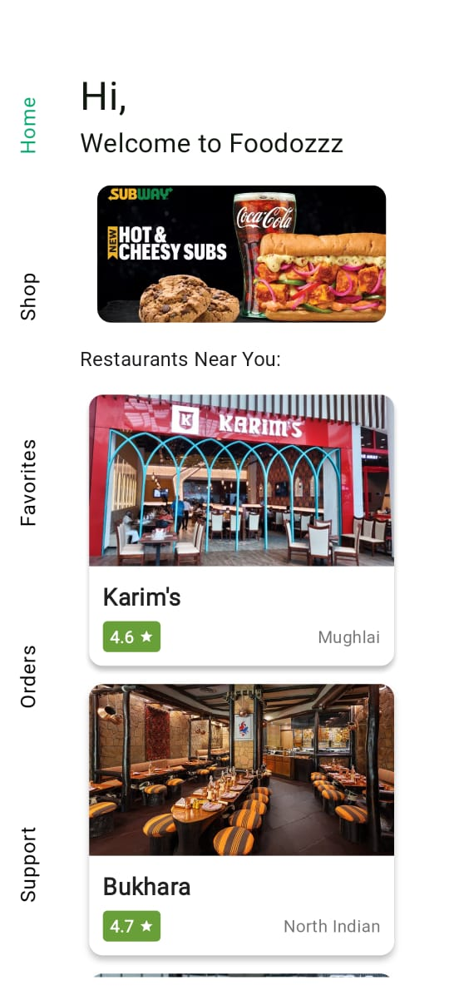
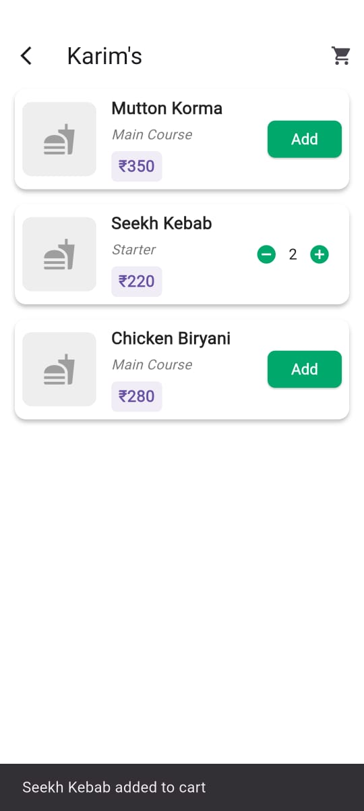
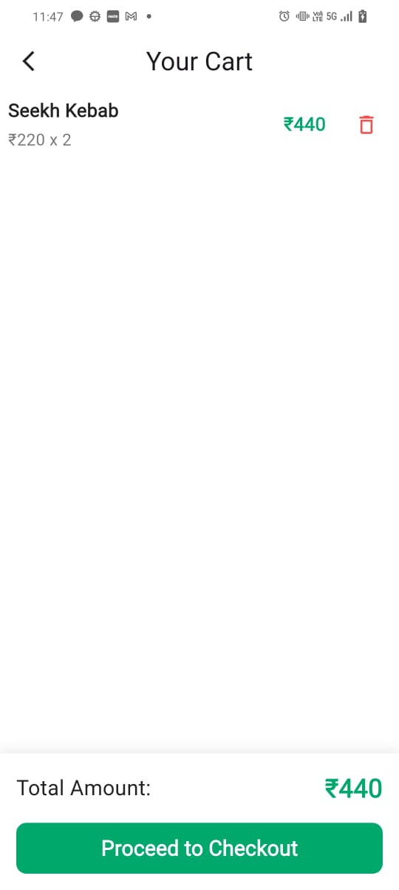

# 🍴 Foodozzz - Food Ordering App  

A Flutter application for browsing restaurant menus, adding items to a cart, and placing orders. The app demonstrates **state management with Bloc**, clean architecture, and responsive UI.  

---

## ✨ Features  

- 📋 Browse restaurants and their menus  
- ➕ Add/Remove items from the cart  
- 🔢 Increase/Decrease item quantity using +/- buttons 
- 🛒 Cart screen with real-time total price calculation  
- 🔄 State management with Flutter Bloc  
- 🎨 Clean UI with Flutter widgets and custom components  

---

## 🛠 Tech Stack  

- **Frontend:** Flutter (Dart)  
- **State Management:** Flutter Bloc  
- **Local Data:** JSON (for demo, can be replaced with Firebase/Backend)  
- **Navigation:** Flutter Navigator  

---

## 📸 Screenshots
| Home Screen | Menu Screen | Cart Screen |
|-------------|-------------|-------------|
|  |  |  |  

---

## 📥 Download APK

You can download the latest version of **Foodozzz** and try it on your Android device:

[Download Foodozzz APK](https://github.com/ananyadix/food_app/releases/tag/v1.0.0)

> ⚠️ Make sure to allow installation from unknown sources on your device to install this APK.  

---

